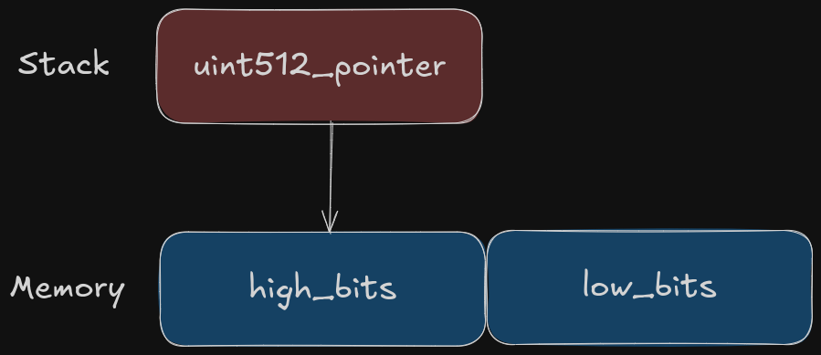
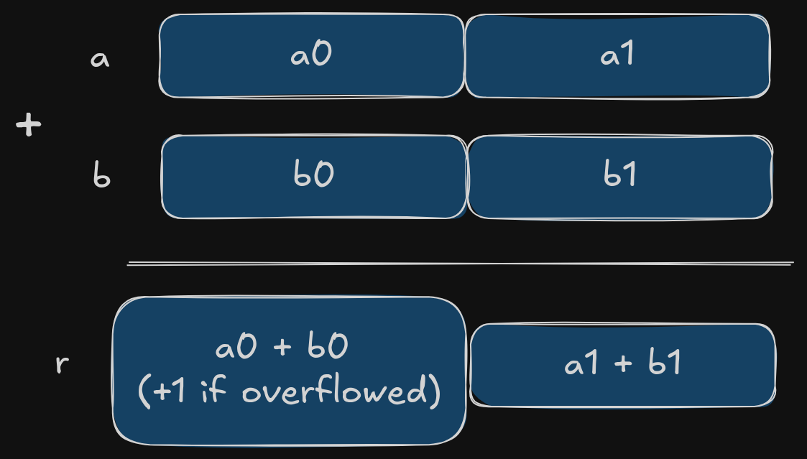

# The most expensive Solidity function

## The problem

Have you ever run into a situation where a smart contract function just won't fit into an Ethereum block because it consumes too much gas? This is the story of how we tackled that very challenge!

It all started during the development of the Rarimo protocol. If you aren't familiar with Rarimo, check out [this post](https://medium.com/@denys.riabtsev/national-passports-verification-with-zkp-part-1-b653f5e5c8d8) for more details. Rarimo lets users prove via ZKP they have a passport from a certain country without revealing any personal details. Today, Rarimo is working to support all types of passports worldwide!

Supporting every passport type is a really challenging task because there are no strict rules for passport cryptography ‒ each country can choose its own method. Some use RSA or ECDSA signatures combined with various hash functions like SHA-256, SHA-384, or SHA-512, and more. OpenPassport even provides a [world map](https://map.openpassport.app/) of the algorithms used in passports. For example, Peru uses only ECDSA signatures on 384-bit curves, while Brazil uses 512-bit curves.

Although it might seem easy to build a solution that supports all these algorithms since the only real difference is the size of the parameters, there's a huge problem: the EVM only supports 256-bit unsigned integers. This limitation means we cannot simply integrate an existing ECDSA library.

So, we had three choices:
1. _Use Zero-Knowledge Proofs:_ Verify the signature with ZK-proofs. The downside was that users would need to download a huge "zkey", which would make the UX worse.
2. _Make a Precompile:_ Create a precompile for signature verification. However, this would require a chain fork, which is not easy.
3. _Do Everything On-Chain:_ Implement all the logic on-chain. Although this method wouldn't work on Mainnet because of high gas costs, it was a good fit for us since Rarimo is a Layer 1 where gas is cheap. Also, the full-on-chain library could be easily reusable if required. Our only challenge was to keep the function's gas usage below 30 million per block.

## BigNumber library

The choice was obvious, so we decided to go with the third approach: implementing ECDSA verification for both 384-bit and 512-bit curves directly on-chain. But we ran into another problem. It turned out that there wasn't an efficient "bigint" library available. Not because no one could write one, but because it's nearly impossible to implement it in a general way that works with arbitrary integer size while keeping the gas consumption as low as possible.

For example, we tried to integrate our Solidity code with the [BigNumber library](https://github.com/firoorg/solidity-BigNumber). This library is really cool and gave us ideas for future improvements, but our verification algorithm still used too much gas because of two issues:
1. _Abstraction costs:_ The library is written in a general way to handle any integer size. However, as is often the case, any abstractions make your code less optimized.
2. _Memory Expansion:_ Solidity doesn't have a heap or allocators for efficient memory management. Once memory is allocated, it is never released, which also results in [memory expansion](https://www.evm.codes/about#memoryexpansion) overhead.

We spent a lot of time looking for a solution. We tried to optimize the library and even emulated a heap and allocators directly in Solidity to cut down the overhead. We even found some bugs and [contributed](https://github.com/firoorg/solidity-BigNumber/pull/18) to the original BigNumber library.

But nothing worked. Our implementation still required more than 400 billion gas for execution plus gas needed for memory expansion overhead. We couldn't even run the whole algorithm in our testing environment because the machine ran out of RAM!

## Uint512 library

Just when we were about to give up and try one of the other options, a sudden idea struck us. We realized that we didn't need a general BigNumber library at all ‒ we only needed 512-bit integers! With everything we had learned from working with the BigNumber library, we believed it's possible to implement our own highly optimized library for 512-bit unsigned integers.

### Memory layout

How to implement a uint512 library most efficiently? The first challenge was deciding how to store a uint512 in memory. Since the integer size is fixed, we can always use 2 memory slots ‒ ach 256 bits ‒ to hold a uint512. But what data type should be used?

- _Structs?_ Not ideal, because when you use structs, you don't have direct control over the memory allocation. Once the "memory" variable is declared, the compiler might make an allocation for it in ways you can't manage.
- _Bytes?_ Also not a good fit, since a bytes type requires an extra memory slot to store its length.

That's why we decided to use raw pointers directly on the stack. They are automatically removed when the function finishes, so only 2 memory slots are used for each uint512. Using less memory reduces the overhead from memory expansion, which is crucial for functions that perform a lot of work.

The diagram below shows how a uint512 is represented in memory:



Even more, starting with Solidity 0.8.8, [user-defined value types](https://soliditylang.org/blog/2021/09/27/user-defined-value-types/) were added, which makes the user experience much smoother. You no longer need to use the "memory" keyword, and you might even forget that the uint512 type isn't built-in!

### Basic operations

Now that we understand how to store our uint512 values, it should be clear how to implement basic operations. The idea is simple: perform the same operation on the matching 256-bit words of the two numbers, and then combine the results correctly.

For example, when adding two uint512 values, you add the lower words first and then the upper words, making sure to handle any overflow from the lower word addition. The diagram below shows how you can implement the add function:



### Modexp magic

But what about mod operations? Is it necessary to write a mod function in Solidity? That would be tough. The answer is no. We can use the [modexp precompile](https://www.evm.codes/precompiled?fork=cancun#0x05) available in the EVM! This built-in feature lets you make a static call to a predefined contract that calculates _b^e mod m_ for any size of input.

This saves a lot of gas because, instead of coding the mod algorithm on-chain, the Ethereum node does the heavy work for you at a low cost. With this tool, it's easy to implement functions like _modexp_ and _mod_ (by setting _e = 1_) directly, as well as _modadd_ and _modmul_ by first computing the overflowed result and then taking it modulo.

However, you must use the modexp precompile carefully. For example, passing the exponent size as 64 bytes would result in the precompile consuming 10 times more gas, even if the exponent was small!

### Multiplication

Multiplication is the most expensive operation so far because its complexity grows quadratically, which leads to many overflows that are hard to manage. The BigNumber library uses a clever trick: instead of computing a * b directly, it calculates _((a + b)² - (a - b)²) / 4_. This equation is mathematically equivalent to _a * b_ and uses basic operations like _add_, _sub_, _mul_, and _shr_ (instead of division by _4_). Although it's an awesome idea, it requires several modexp calls along with many intermediate steps and extra memory allocations, making it inefficient.

It turned out that for small integers, a column-by-column multiplication, as shown in the diagram below, is more efficient:


But when multiplying 512-bit numbers stored as two 256-bit words, we must multiply the corresponding words and handle the carries accurately. This is not as straightforward as it seems. Multiplying two 256-bit numbers can generate a huge carry, and we only have Solidity's built-in uint256 arithmetic to work with.

Fortunately, this is a known problem that can be solved efficiently using the EVM's [modmul opcode](https://www.evm.codes/?fork=cancun#09). Remco Bloemen explains this approach in his article [Mathemagic finale: muldiv](https://xn--2-umb.com/21/muldiv/). We don't need the division part of his method, but the small piece of code that calculates the most significant 256 bits of the product ‒ "huge carry". It's only three lines of code, but it packs a lot of math:

```solidity
// 512-bit multiply [prod1 prod0] = a * b
// Compute the product mod 2**256 and mod 2**256–1
// then use the Chinese Remainder Theorem to reconstruct
// the 512 bit result. The result is stored in two 256
// variables such that product = prod1 * 2**256 + prod0
uint256 prod0; // Least significant 256 bits of the product
uint256 prod1; // Most significant 256 bits of the product
assembly {
 let mm := mulmod(a, b, not(0))
 prod0 := mul(a, b)
 prod1 := sub(sub(mm, prod0), lt(mm, prod0))
}
```

Applying this method for each inner operation brings the gas consumption of the uint512 multiplication function very close to that of the addition function: 353 gas (_mul_) vs 256 gas (_add_). Similarly, since only one modexp call is needed, the modulo versions become much more efficient 1176 gas (_modmul_) 760 gas (_modadd_).

### Reuse Memory

While our current library works well from an algorithmic perspective, we still haven't solved the memory expansion issue completely. One major problem with the BigNumber library was that it allocates memory for every modexp precompile call. Our ECDSA algorithm, however, makes thousands of such calls, and each call uses 384 bytes of memory! This extra memory quickly adds up ‒ and the EVM never releases it once allocated.

But here's the good news: once a mod operation is complete, that memory is no longer needed. So why not help the EVM reuse that memory? Instead of allocating memory every time, we can allocate it once at the beginning of a heavy function and then pass the pointer to it to each mod operation. This way, no extra memory is allocated internally. For lighter functions, we even provide a version that allocates memory internally if you don't plan on doing many operations.

Another neat feature we added is assignment operations. When working with complex formulas, you don't always need to create new integer objects ‒ you can simply assign new values to existing ones. This helps control memory usage and reduces overhead.

The code example below shows how it works: first, you create a call pointer, which points to memory for internal purposes. Then, you pass this pointer into each _mod_ function so that no additional memory is allocated. You also use assignment operations so that you reuse memory and no new integers are created. This approach makes memory control much easier!

```solidity
call512 call_ = U512.initCall(); 
uint512 a_ = U512.fromUint256(3); 
uint512 b_ = U512.fromUint256(6); 
uint512 m_ = U512.fromUint256(5); 
uint512 r_ = U512.modadd(call_, a_, b_, m_); // 4 
U512.modmulAssign(call_, r_, a_, m_); // assigns (r_ * a_) % m_ to r_
r_.eq(U512.fromUint256(2)); // true
r_.toBytes(); // "0x00..02"
```

## Gas estimation

By applying all the optimizations, we achieved some impressive results:

| uint512 operation | Avg gas  |
| ----------------- | -------- |
| add               | 269 gas  |
| sub               | 278 gas  |
| mul               | 353 gas  |
| mod               | 682 gas  |
| modinv            | 6083 gas |
| modadd            | 780 gas  |
| redadd            | 590 gas  |
| modmul            | 1176 gas |
| modsub            | 1017 gas |
| redsub            | 533 gas  |
| modexp            | 5981 gas |
| modexpU256        | 692 gas  |
| moddiv            | 7092 gas |
| and               | 251 gas  |
| or                | 251 gas  |
| xor               | 251 gas  |
| not               | 216 gas  |
| shl               | 272 gas  |
| shr               | 272 gas  |

For the ECDSA algorithm, the 384-bit curves consume 8.9 million gas and the 512-bit curves consume 13.6 million gas ‒ a **30,000x improvement** compared to the initial version!

## Reference implementation

All the library implementations are available in our open-source Solidity library. These libraries are battle-tested in real projects and have 100% test coverage. But always DYOR before use them in production!

- U512 Library: [U512.sol](https://github.com/dl-solarity/solidity-lib/blob/master/contracts/libs/bn/U512.sol)
- ECDSA384: [ECDSA384.sol](https://github.com/dl-solarity/solidity-lib/blob/master/contracts/libs/crypto/ECDSA384.sol)
- ECDSA512: [ECDSA512.sol](https://github.com/dl-solarity/solidity-lib/blob/master/contracts/libs/crypto/ECDSA512.sol)

If you like this work, please give a star to our [GitHub Repository](https://github.com/dl-solarity/solidity-lib)! :)
